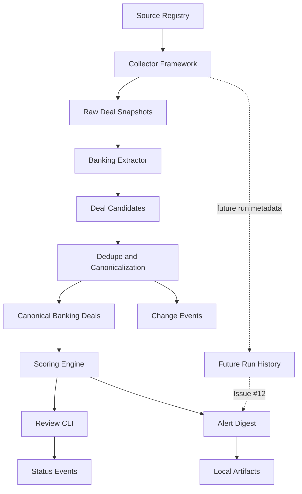

# Banking MVP Architecture

This document describes the initial architecture for the Banking MVP of Personal Deal Intelligence.

## Goal

Build a local-first system that discovers, structures, scores, reviews, and summarizes banking promotions for personal use.

The system should reduce repeated manual deal checking while keeping the user in control of final review and action.

## Scope

Included:

- checking bonuses
- savings bonuses
- checking + savings bundle bonuses
- brokerage transfer/deposit bonuses
- money market and CD bonuses
- local review workflow
- local digest
- offline fixture pipeline

Deferred:

- clothing deals
- travel deals
- flight search
- hotel deals
- cashback stack optimizer
- browser extension
- full hosted app
- run history and dry-run orchestration

## Data flow



If Mermaid rendering is not supported in a viewer, treat the diagram as a text representation of the pipeline.

## Layer responsibilities

### 1. Source registry

Purpose: define which banking sources exist and what collection behavior is allowed.

Implemented source policy is config-first. `config/banking_sources.yaml` is the
machine-readable source registry, and `python3 -m pdi.sources validate --config
config/banking_sources.yaml` validates it. The existing SQLite `source_records`
table is provenance for stored snapshots; it is not the policy authority.

Expected source types:

- `manual_url`
- `official_promo_page`
- `rss_feed`
- `newsletter_email`
- `deal_blog`
- `affiliate_feed`
- `api`
- `disabled`

Each source should define:

- `name`
- `url`
- `source_type`
- `category_scope`
- `subcategory_scope`
- `enabled`
- `collection_method`
- `max_frequency_hours`
- `requires_login`
- `allow_scrape`
- `allow_api`
- `allow_rss`
- `allow_email_parse`
- `robots_policy_notes`
- `terms_policy_notes`
- `rate_limit_notes`
- `compliance_status`
- `last_reviewed_at`
- `notes`

Unsafe behavior is disabled by default. Validation rejects unknown fields,
unsafe source-access flags, logged-in scraping, unapproved enabled sources,
method/allow-flag mismatches, high-frequency scraping, and scopes outside the
Banking MVP.

### 2. Collector framework

Purpose: convert allowed sources into raw snapshots.

Implemented collectors are exposed under `pdi.collectors` and normalize raw
content into `CollectedSnapshot` objects that can be persisted to
`raw_deal_snapshots`.

Initial collectors include:

- manual text collector
- manual URL record collector
- RSS/Atom fixture collector
- newsletter/export text collector
- API fixture-backed collector

HTML fetching has no built-in live network client. Any future fetch path must use
an enabled, approved source policy that explicitly allows non-login scraping, and
must pass frequency checks before an injected fetcher can run. Tests use fixtures
or injected fetchers only and must not require internet access by default.

### 3. Raw snapshots

Purpose: preserve source evidence before extraction.

Raw snapshots should include:

- source name
- source URL or identifier
- retrieved timestamp
- content hash
- raw text
- optional raw payload metadata
- HTTP status if relevant
- collector name

Raw snapshots allow re-extraction when extractor logic improves.

### 4. Banking extractor

Purpose: transform raw text into structured banking deal candidates.

Implemented extraction is deterministic and offline-only under `pdi.extractors`.
It reads raw snapshot text and source metadata, produces pre-dedupe
`banking_deal_candidates`, and does not create or update canonical
`banking_deals`.

Extractor identifies:

- institution name
- promotion title
- subcategory
- bonus amount
- direct deposit requirement
- minimum deposit or balance
- holding period
- monthly fee
- fee waiver terms
- early closure terms
- state restrictions
- new customer restrictions
- expiration date
- evidence spans
- confidence score
- missing fields

Extraction must not guess. Unknown fields should remain null/unknown.
Evidence spans, missing fields, extraction notes, and tiered bonus matches are
stored with candidates for review and later dedupe/canonicalization.

### 5. Dedupe and canonicalization

Purpose: merge repeated references to the same deal.

Implemented dedupe and canonicalization is exposed under `pdi.dedupe`. It
consumes non-rejected `banking_deal_candidates`, creates or updates canonical
`banking_deals`, links every candidate/source snapshot to
`banking_deal_source_links`, and records material differences in
`deal_change_events`.

Matching uses conservative signals:

- normalized institution name
- subcategory
- bonus amount
- account/product name
- expiration date if known
- source URL path/domain clues

The layer supports exact canonical-key matches, same-source/product matches, and
strong fuzzy matches by institution, subcategory, bonus amount, compatible
expiration, and compatible product evidence. Low-confidence candidates do not
fuzzy-merge. Important conflicts are preserved in change events and mark the
canonical deal `needs_review` instead of silently overwriting high-confidence or
official-source data.

### 6. Scoring engine

Purpose: rank deals based on expected personal value.

Implemented scoring is exposed under `pdi.scoring` and reads configurable
assumptions from `config/banking_scoring.yaml`. It scores canonical
`banking_deals`, can persist `estimated_net_value_cents` to the existing
canonical row, and returns the full component breakdown for callers.

Scoring components:

- gross bonus value
- fee cost
- cash lockup opportunity cost
- direct deposit friction
- hassle penalty
- risk/restriction penalty
- missing data penalty
- expiration urgency

Outputs:

- estimated net value
- score from 0 to 100
- score band
- recommended action
- explanation
- missing data warnings

Scoring is transparent and configurable. It is for personal review support only
and must not be presented as financial advice.

### 7. Review CLI

Purpose: let the user inspect and update deals locally.

Implemented commands:

```bash
python3 -m pdi --db data/pdi.sqlite banking list
python3 -m pdi --db data/pdi.sqlite banking show <deal_id>
python3 -m pdi --db data/pdi.sqlite banking update-status <deal_id> <status>
python3 -m pdi --db data/pdi.sqlite banking review-needed
python3 -m pdi --db data/pdi.sqlite banking expiring --days 14
python3 -m pdi --db data/pdi.sqlite banking search --institution <name>
python3 -m pdi --db data/pdi.sqlite banking score <deal_id>
```

The list-style commands support terminal table output by default and JSON with
`--format json`. `list` supports filters for status, institution, subcategory,
score band, recommended action, expiration window, and needs-review state.
`show` includes terms, score explanation, source URLs, missing-data warnings,
evidence links when available, and status history.

Status updates create `deal_status_events` records and update the local
canonical deal status. Status values include `new`, `needs_review`, `watching`,
`interested`, `in_progress`, `completed`, `skipped`, `expired`, and `rejected`;
legacy `applied` rows remain accepted for compatibility.

The CLI is a personal review aid only. It does not request credentials, perform
applications, enroll in offers, or move money. Final offer terms should be
verified on the official institution page before acting.

### 8. Digest

Purpose: summarize high-signal deals.

Implemented alert digest support is exposed under `pdi.alerts` and through
`python3 -m pdi banking digest`. It reads canonical deals, scoring outputs,
source links, change events, and status events from the local SQLite database,
then writes local markdown or JSON artifacts.

Digest sections:

- Review Now
- Expiring Soon
- Changed Deals
- Needs More Information
- Watchlist Updates

Digest outputs are local markdown first, with JSON available for deterministic
tests and future automation.

External notifications are disabled by default. The implemented notification
hook is no-op/dry-run only and does not send live messages.

### 8a. Offline fixture smoke flow

Purpose: prove the Banking MVP components work together without live sources.

Implemented smoke support is exposed under `pdi.smoke` and through
`python3 -m pdi banking smoke-test`. It loads synthetic local text fixtures,
creates raw snapshots, extracts candidates, canonicalizes duplicates and
conflicts, scores canonical deals, writes a local markdown digest, and prints
summary counts.

The smoke flow is fixture-only. It does not fetch websites, use browser
automation, connect email accounts, send external messages, or automate banking
actions.

### 8b. Reusable demo corpus

Purpose: provide realistic local demo source inputs without live collection.

Issue #14 adds `config/banking_sources.demo.yaml` and `examples/demo_banking/`
as a synthetic source seed pack. The corpus covers official-page style fixtures,
deal-blog RSS content, newsletter export text, manual pasted notes, disabled
source policy coverage, duplicates, conflicts, expired and low-value offers,
ambiguous terms, non-deal content, and the main Banking MVP subcategories.

The demo corpus is loaded through existing offline collectors and source policy
validation. It does not add product-facing search, a fresh-clone demo gate, live
fetching, browser automation, email account access, credentials, notifications,
or banking actions.

### 9. Run history

Purpose: track repeated runs and failures.

Implemented run history support is exposed through `pdi.runs` and through:

```bash
python3 -m pdi --db data/pdi.sqlite banking run
python3 -m pdi --db data/pdi.sqlite banking run --dry-run
python3 -m pdi --db data/pdi.sqlite banking run --execute
python3 -m pdi --db data/pdi.sqlite banking runs --limit 10
python3 -m pdi --db data/pdi.sqlite banking run-status <run_id>
```

Run records include:
Status: deferred to Issue #12. The current Banking MVP has an offline smoke
command but does not persist run records, expose a `banking run --dry-run`
command, list past runs, or block overlapping runs.

Run records should include:

- run id
- start time
- end time
- status
- dry-run flag
- source counts
- candidate counts
- canonical deal counts
- conflicts
- errors
- digest path

The default run mode is dry-run. Dry-run records only run history in the real
database, executes the workflow against a temporary database copy, avoids
durable digest writes, and stores the requested digest path as metadata. Durable
workflow changes require explicit `--execute`.

Overlapping runs are blocked by a SQLite lock row with a unique `lock_name` and
local owner metadata. The lock is released after successful or failed runs.
Blocked runs are recorded without taking over the existing lock. Stale lock
cleanup is intentionally manual for now.

## Storage model

The first storage implementation uses SQLite with stdlib `sqlite3`, versioned
SQL migrations, and package helpers under `src/pdi/storage/`.

Implemented SQLite-backed concepts:

- source records
- raw deal snapshots
- canonical banking deals
- banking deal terms
- extracted banking deal candidates
- canonical deal source links
- deal status events
- deal change events
- banking run history
- banking run locks

Future issues may add score records if durable score history becomes useful.

## Configuration

Expected config files:

- `config/banking_sources.yaml` (implemented)
- `config/banking_scoring.yaml` (implemented)
- `config/banking_alerts.yaml` (implemented)

Do not store secrets in config files. Use environment variables only if external integrations are later added.

## Safety boundaries

The architecture must keep:

- source collection limited to configured allowed methods
- private-session data outside automated collection
- private auth material and highly sensitive personal identifiers outside project storage
- financial actions, applications, enrollment, and money movement under direct user control
- external notifications and live collection disabled unless a future issue adds explicit policy, tests, and review steps

## First usable MVP

The first usable release should support:

1. offline fixture pipeline
2. local database
3. structured extraction from sample banking promotion text
4. dedupe/canonicalization
5. score calculation
6. CLI review
7. local digest generation

Live sources can be added only after source policy, fixture tests, and safety checks are stable.
